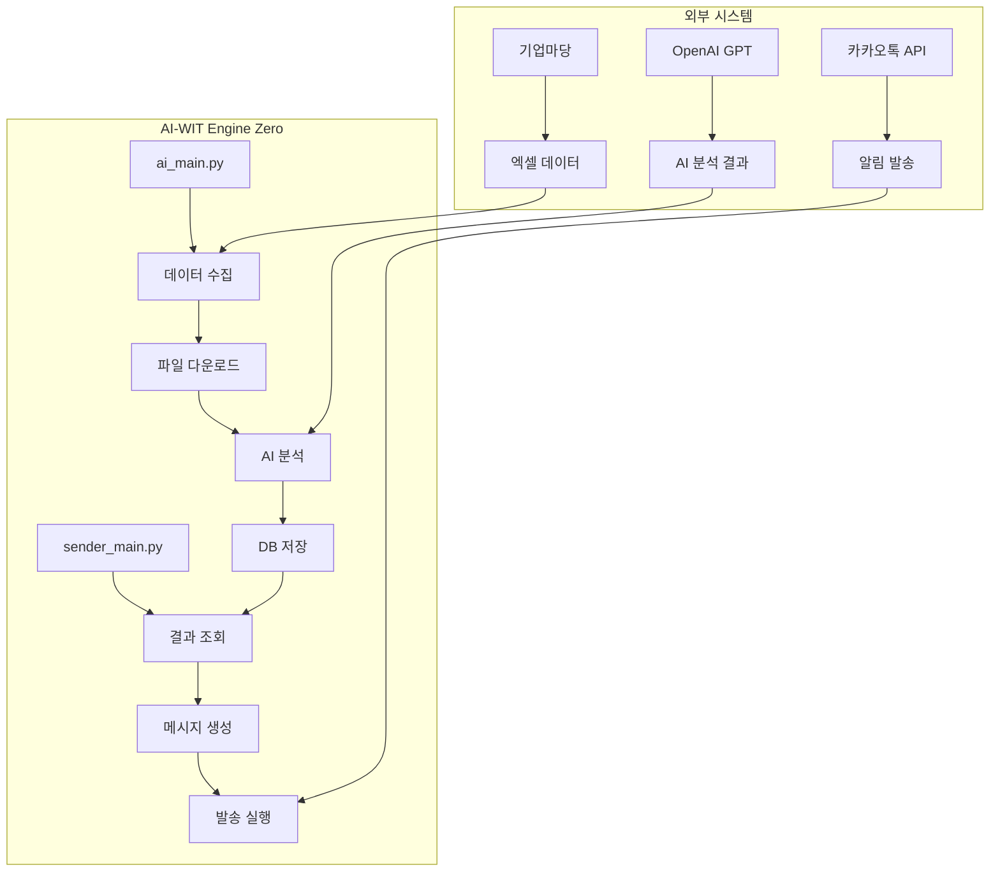
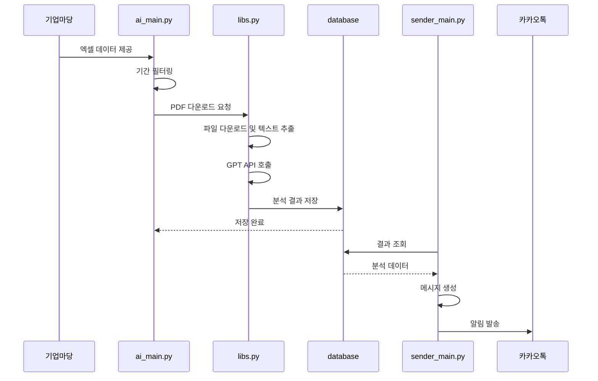

# 시스템 아키텍처

AI-WIT Engine Zero의 전체적인 시스템 구조와 설계 원칙을 설명합니다.

## 🏛️ 전체 아키텍처 개요

AI-WIT Engine Zero는 기업마당 공고를 자동으로 수집하고 AI로 분석하여 사용자에게 전달하는 배치 처리 시스템입니다.



## 🧩 컴포넌트 상세

### 1. 데이터 수집 컴포넌트 (`ai_main.py`)

기업마당에서 공고 데이터를 수집하는 메인 컴포넌트입니다.

**주요 기능**:
- 기업마당 엑셀 데이터 다운로드
- 기간별 공고 필터링
- 공고 상세 페이지 접근 및 PDF 파일 추출

**입력**: 기간(일 단위)
**출력**: 분석된 공고 데이터 및 AI 결과

### 2. 유틸리티 라이브러리 (`libs.py`)

시스템의 핵심 기능을 제공하는 유틸리티 함수들입니다.

**주요 모듈**:
- **웹 스크래핑**: `download_files()`, `extract_text_from_pdf()`
- **AI 처리**: `analyze_pdf()`, `ask_chatgpt()`
- **메시징**: `send_kakao_alert()`
- **데이터 처리**: `formatJson()`

### 3. 데이터베이스 레이어

데이터 저장 및 관리를 담당합니다.

**컴포넌트**:
- `database.py`: 연결 설정 및 세션 관리
- `models.py`: 데이터베이스 스키마 정의
- `db_handlers.py`: CRUD 작업 처리

**주요 테이블**:
- `Notice`: 공고 기본 정보
- `AIResult`: AI 분석 결과

### 4. 메시지 발송 컴포넌트 (`sender_main.py`)

분석된 결과를 카카오톡으로 발송합니다.

**주요 기능**:
- 기간별 결과 조회
- 메시지 템플릿 생성
- 대량 발송 처리

## 📊 데이터 흐름



## 🗂️ 프로젝트 구조

```
engine-zero/
├── engine0/                    # 메인 애플리케이션
│   ├── ai_main.py             # 공고 수집 및 분석 메인
│   ├── sender_main.py         # 메시지 발송 메인
│   ├── database.py            # DB 연결 설정
│   ├── models.py              # 데이터베이스 모델
│   ├── db_handlers.py         # DB CRUD 핸들러
│   ├── libs.py                # 유틸리티 함수들
│   ├── kakao_friend_list.py   # 카카오 친구 목록 (선택)
│   └── src/
│       └── lib/               # 설정 및 라이브러리
│           ├── config.ini     # 설정 파일
│           ├── auth.py        # 인증 관련
│           ├── config.py      # 설정 로더
│           ├── message.py     # 메시지 처리
│           └── storage.py     # 저장소 관리
├── data/                      # 데이터 파일
│   └── *.sql                  # 초기 데이터
├── docs/                      # 문서
│   ├── api.md                 # API 문서
│   ├── setup.md               # 설치 가이드
│   └── architecture.md        # 아키텍처 문서
├── files/                     # 다운로드된 파일들
├── AI.Rule.local.md           # 프로젝트 규칙
├── requirements.txt           # 의존성 패키지
└── README.md                  # 프로젝트 소개
```

## 🔧 기술 스택

### 프로그래밍 언어
- **Python 3.8+**: 메인 프로그래밍 언어

### 주요 라이브러리
- **SQLAlchemy**: 데이터베이스 ORM
- **Pandas**: 데이터 처리 및 분석
- **BeautifulSoup4**: HTML 파싱
- **Requests**: HTTP 클라이언트
- **PyPDF2**: PDF 텍스트 추출
- **OpenAI**: GPT API 연동

### 외부 서비스
- **OpenAI GPT-4o-mini**: AI 분석 엔진
- **카카오톡 API**: 메시지 발송
- **기업마당**: 공고 데이터 소스

### 데이터베이스
- **SQLite**: 기본 데이터베이스 (개발용)
- **PostgreSQL**: 프로덕션용 데이터베이스

## 🎯 설계 원칙

### 1. 단일 책임 원칙 (SRP)
- 각 모듈은 하나의 주요 책임을 가짐
- `ai_main.py`: 데이터 수집
- `libs.py`: 유틸리티 기능
- `database.py`: 데이터베이스 관리

### 2. 의존성 역전 원칙 (DIP)
- 고수준 모듈은 저수준 모듈에 의존하지 않음
- 인터페이스를 통한 느슨한 결합

### 3. 개방-폐쇄 원칙 (OCP)
- 확장에는 열려있고, 수정에는 닫혀있음
- 새로운 분석 기능 추가 시 기존 코드 수정 최소화

### 4. 리스코프 치환 원칙 (LSP)
- 상위 타입을 하위 타입으로 대체 가능
- 데이터베이스 인터페이스의 일관성

### 5. 인터페이스 분리 원칙 (ISP)
- 클라이언트는 불필요한 인터페이스에 의존하지 않음
- 필요한 기능만 노출

## 🔄 배치 처리 워크플로

1. **스케줄링**: 정해진 시간에 `ai_main.py` 실행
2. **데이터 수집**: 기업마당에서 최신 공고 데이터 수집
3. **필터링**: 설정된 기간 내의 공고만 처리
4. **다운로드**: 각 공고의 PDF 파일 다운로드
5. **AI 분석**: GPT를 사용하여 공고 내용 구조화
6. **저장**: 분석 결과를 데이터베이스에 저장
7. **발송**: 분석 결과를 카카오톡으로 발송

## 🚀 확장성 고려사항

### 수평적 확장
- 다중 인스턴스 배포 가능
- 데이터베이스 공유를 통한 분산 처리

### 새로운 분석 엔진 추가
- `libs.py`의 `analyze_pdf()` 함수 확장
- 새로운 AI 서비스 인터페이스 추가

### 다양한 메시징 채널
- 카카오톡 외 이메일, SMS 등 지원 가능
- 전략 패턴을 통한 메시징 인터페이스 설계

### 모니터링 및 로깅
- 실행 로그 저장
- 성능 메트릭 수집
- 오류 알림 시스템

## 🔒 보안 고려사항

- **API 키 관리**: 환경 변수 또는 안전한 설정 파일 사용
- **데이터 검증**: 외부 입력 데이터의 유효성 검증
- **에러 처리**: 예외 상황에 대한 적절한 처리
- **접근 제어**: 민감한 설정 파일의 권한 관리